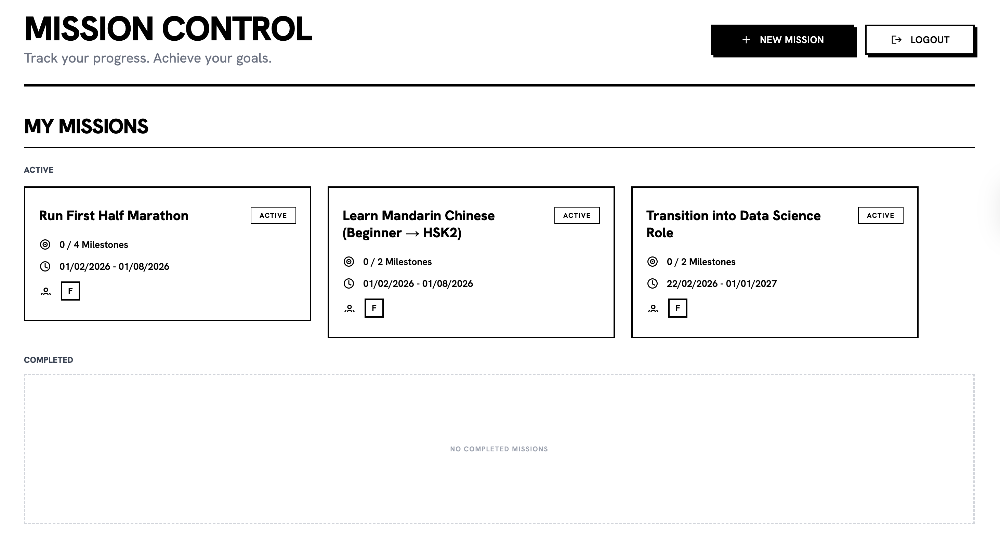
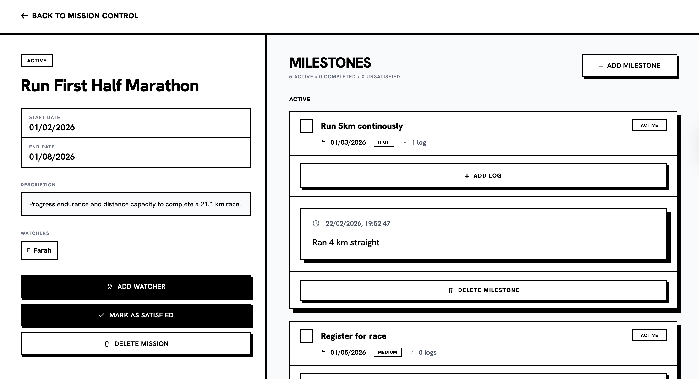

# 🎯 Goal Accountability & Milestone Platform

A full-stack goal tracking system where users define long-term goals (“missions”), break them into milestones, log progress over time, and share visibility with peers for accountability.

Built with **Next.js, Supabase (PostgreSQL), Tailwind, and Vercel**.

---

## ✨ Features

- Structured goal (“mission”) creation and tracking  
- Milestone decomposition and completion flow  
- Timestamped progress logs  
- Watchers for shared visibility and accountability  
- Secure multi-user access via Supabase Auth + Row-Level Security  

---

## 🖥️ Application Pages

### 🔐 Landing / Login  
Authentication entry point to access personal missions.

### 📊 Mission Dashboard  
Overview of all missions with status and progress indicators.

### 🎯 Mission Detail  
Detailed mission view with milestones, logs, and watchers.

---

## 🧪 Demo Account

You can explore the app using the demo credentials:  
**Email:** demo@mission.app  
**Password:** demo123  

---

## 🧱 Tech Stack

- **Frontend:** Next.js (App Router), React, Tailwind  
- **Backend/Data:** Supabase (PostgreSQL, Auth, RLS)  
- **Deployment:** Vercel  
- **Architecture:** Client ↔ Supabase REST APIs  

---

## 📸 Screenshots

### Mission Dashboard


### Mission Detail


---

## 🚀 Running Locally

```bash
npm install
npm run dev

NEXT_PUBLIC_SUPABASE_URL=your_url
NEXT_PUBLIC_SUPABASE_ANON_KEY=your_key
```

## 📈 Future Improvements

- Notifications for milestone updates  
- Activity feed for watched missions  
- Progress visualisation across milestones  
- Mobile optimisation  

---

## 👤 Author

**Farah Abdi**  

---

## 📄 License

Personal project for portfolio use.

